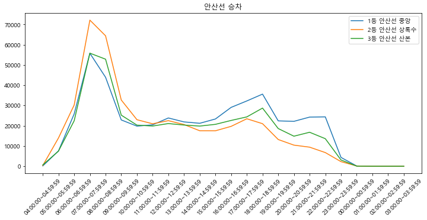
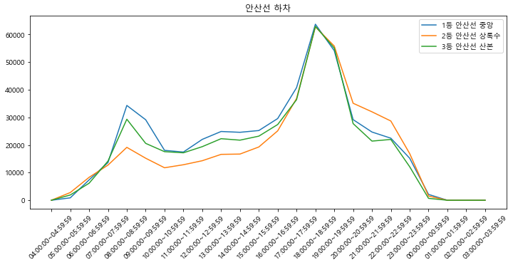
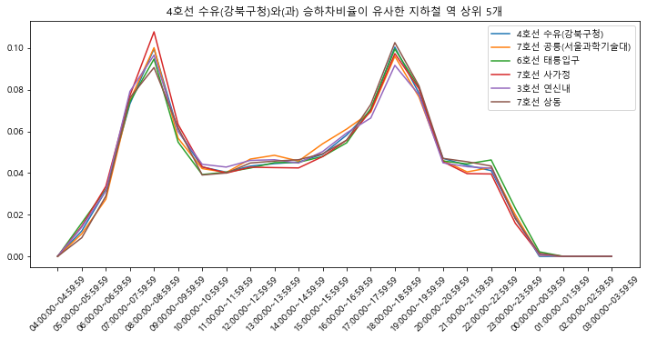
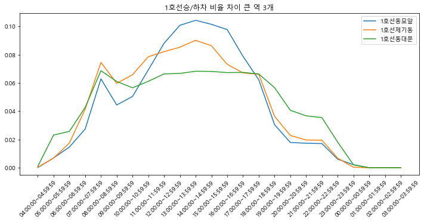
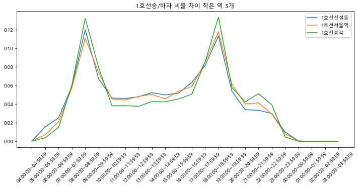

```python
import pandas as pd
import numpy as np
import matplotlib.pyplot as plt

plt.rcParams["figure.figsize"] = [12,5]
plt.rc("font",family = "Malgun Gothic")
#plt.rcParams["axes.grid"] = True
```


```python
df = pd.read_csv("subway_time.csv", encoding = "cp949")

df = df.drop(0)

col_list = []
for col in df:
    if "Unnamed" in col:
        col_list.append(temp + "하차")
    else:
        col_list.append(col + "승차")
    temp = col
    
df.columns = col_list
df.rename(columns = {"호선명승차" : "호선명"}, inplace=True)
df.rename(columns = {"지하철역승차" : "지하철역"}, inplace=True)
columns = list(df.columns[2:])
df[columns] = df[columns].astype(float)
total_index = list(range(8, 14)) + list(range(28,34))
df["유동인구"] = df.iloc[:, total_index].sum(axis=1)
df
```


<div>
<style scoped>
    .dataframe tbody tr th:only-of-type {
        vertical-align: middle;
    }

    .dataframe tbody tr th {
        vertical-align: top;
    }

    .dataframe thead th {
        text-align: right;
    }
</style>
<table border="1" class="dataframe">
  <thead>
    <tr style="text-align: right;">
      <th></th>
      <th>호선명</th>
      <th>지하철역</th>
      <th>04:00:00~04:59:59승차</th>
      <th>04:00:00~04:59:59하차</th>
      <th>05:00:00~05:59:59승차</th>
      <th>05:00:00~05:59:59하차</th>
      <th>06:00:00~06:59:59승차</th>
      <th>06:00:00~06:59:59하차</th>
      <th>07:00:00~07:59:59승차</th>
      <th>07:00:00~07:59:59하차</th>
      <th>...</th>
      <th>23:00:00~23:59:59하차</th>
      <th>00:00:00~00:59:59승차</th>
      <th>00:00:00~00:59:59하차</th>
      <th>01:00:00~01:59:59승차</th>
      <th>01:00:00~01:59:59하차</th>
      <th>02:00:00~02:59:59승차</th>
      <th>02:00:00~02:59:59하차</th>
      <th>03:00:00~03:59:59승차</th>
      <th>03:00:00~03:59:59하차</th>
      <th>유동인구</th>
    </tr>
  </thead>
  <tbody>
    <tr>
      <th>1</th>
      <td>1호선</td>
      <td>서울역</td>
      <td>746.0</td>
      <td>16.0</td>
      <td>9151.0</td>
      <td>6038.0</td>
      <td>11560.0</td>
      <td>33958.0</td>
      <td>36079.0</td>
      <td>87958.0</td>
      <td>...</td>
      <td>7638.0</td>
      <td>13.0</td>
      <td>570.0</td>
      <td>0.0</td>
      <td>0.0</td>
      <td>0.0</td>
      <td>0.0</td>
      <td>0.0</td>
      <td>0.0</td>
      <td>1093300.0</td>
    </tr>
    <tr>
      <th>2</th>
      <td>1호선</td>
      <td>동묘앞</td>
      <td>57.0</td>
      <td>3.0</td>
      <td>2966.0</td>
      <td>885.0</td>
      <td>3409.0</td>
      <td>4736.0</td>
      <td>5917.0</td>
      <td>9312.0</td>
      <td>...</td>
      <td>2344.0</td>
      <td>3.0</td>
      <td>1198.0</td>
      <td>0.0</td>
      <td>0.0</td>
      <td>0.0</td>
      <td>0.0</td>
      <td>0.0</td>
      <td>0.0</td>
      <td>170387.0</td>
    </tr>
    <tr>
      <th>3</th>
      <td>1호선</td>
      <td>시청</td>
      <td>29.0</td>
      <td>0.0</td>
      <td>1711.0</td>
      <td>3796.0</td>
      <td>2774.0</td>
      <td>19145.0</td>
      <td>6323.0</td>
      <td>61361.0</td>
      <td>...</td>
      <td>1308.0</td>
      <td>5.0</td>
      <td>86.0</td>
      <td>0.0</td>
      <td>0.0</td>
      <td>0.0</td>
      <td>0.0</td>
      <td>0.0</td>
      <td>0.0</td>
      <td>609561.0</td>
    </tr>
    <tr>
      <th>4</th>
      <td>1호선</td>
      <td>종각</td>
      <td>137.0</td>
      <td>0.0</td>
      <td>2075.0</td>
      <td>4407.0</td>
      <td>2943.0</td>
      <td>22272.0</td>
      <td>5344.0</td>
      <td>96690.0</td>
      <td>...</td>
      <td>1341.0</td>
      <td>14.0</td>
      <td>133.0</td>
      <td>3.0</td>
      <td>2.0</td>
      <td>0.0</td>
      <td>0.0</td>
      <td>0.0</td>
      <td>0.0</td>
      <td>925481.0</td>
    </tr>
    <tr>
      <th>5</th>
      <td>1호선</td>
      <td>종로3가</td>
      <td>143.0</td>
      <td>25.0</td>
      <td>3056.0</td>
      <td>3179.0</td>
      <td>2944.0</td>
      <td>11751.0</td>
      <td>4731.0</td>
      <td>25513.0</td>
      <td>...</td>
      <td>2093.0</td>
      <td>16.0</td>
      <td>384.0</td>
      <td>0.0</td>
      <td>0.0</td>
      <td>0.0</td>
      <td>0.0</td>
      <td>0.0</td>
      <td>0.0</td>
      <td>491633.0</td>
    </tr>
    <tr>
      <th>...</th>
      <td>...</td>
      <td>...</td>
      <td>...</td>
      <td>...</td>
      <td>...</td>
      <td>...</td>
      <td>...</td>
      <td>...</td>
      <td>...</td>
      <td>...</td>
      <td>...</td>
      <td>...</td>
      <td>...</td>
      <td>...</td>
      <td>...</td>
      <td>...</td>
      <td>...</td>
      <td>...</td>
      <td>...</td>
      <td>...</td>
      <td>...</td>
    </tr>
    <tr>
      <th>604</th>
      <td>우이신설선</td>
      <td>북한산보국문</td>
      <td>1.0</td>
      <td>1.0</td>
      <td>2001.0</td>
      <td>626.0</td>
      <td>6684.0</td>
      <td>2370.0</td>
      <td>19654.0</td>
      <td>5036.0</td>
      <td>...</td>
      <td>4288.0</td>
      <td>4.0</td>
      <td>4.0</td>
      <td>0.0</td>
      <td>0.0</td>
      <td>0.0</td>
      <td>0.0</td>
      <td>0.0</td>
      <td>0.0</td>
      <td>151333.0</td>
    </tr>
    <tr>
      <th>605</th>
      <td>우이신설선</td>
      <td>정릉</td>
      <td>2.0</td>
      <td>1.0</td>
      <td>1917.0</td>
      <td>460.0</td>
      <td>5181.0</td>
      <td>1586.0</td>
      <td>13616.0</td>
      <td>2977.0</td>
      <td>...</td>
      <td>2073.0</td>
      <td>1.0</td>
      <td>3.0</td>
      <td>0.0</td>
      <td>0.0</td>
      <td>0.0</td>
      <td>0.0</td>
      <td>0.0</td>
      <td>0.0</td>
      <td>110123.0</td>
    </tr>
    <tr>
      <th>606</th>
      <td>우이신설선</td>
      <td>성신여대입구(돈암)</td>
      <td>0.0</td>
      <td>0.0</td>
      <td>823.0</td>
      <td>321.0</td>
      <td>1223.0</td>
      <td>1114.0</td>
      <td>3408.0</td>
      <td>3726.0</td>
      <td>...</td>
      <td>1075.0</td>
      <td>1.0</td>
      <td>8.0</td>
      <td>0.0</td>
      <td>0.0</td>
      <td>0.0</td>
      <td>0.0</td>
      <td>0.0</td>
      <td>0.0</td>
      <td>76371.0</td>
    </tr>
    <tr>
      <th>607</th>
      <td>우이신설선</td>
      <td>보문</td>
      <td>0.0</td>
      <td>0.0</td>
      <td>400.0</td>
      <td>260.0</td>
      <td>748.0</td>
      <td>1343.0</td>
      <td>2136.0</td>
      <td>3049.0</td>
      <td>...</td>
      <td>669.0</td>
      <td>0.0</td>
      <td>19.0</td>
      <td>0.0</td>
      <td>0.0</td>
      <td>0.0</td>
      <td>0.0</td>
      <td>0.0</td>
      <td>0.0</td>
      <td>36391.0</td>
    </tr>
    <tr>
      <th>608</th>
      <td>우이신설선</td>
      <td>신설동</td>
      <td>5.0</td>
      <td>0.0</td>
      <td>966.0</td>
      <td>716.0</td>
      <td>1262.0</td>
      <td>2126.0</td>
      <td>1345.0</td>
      <td>5149.0</td>
      <td>...</td>
      <td>624.0</td>
      <td>0.0</td>
      <td>217.0</td>
      <td>0.0</td>
      <td>0.0</td>
      <td>0.0</td>
      <td>0.0</td>
      <td>0.0</td>
      <td>0.0</td>
      <td>57917.0</td>
    </tr>
  </tbody>
</table>
<p>608 rows × 51 columns</p>
</div>


## 출퇴근 시간 유동인구가 많은 역 상위 3개 승/하차 인원시각화


```python
df_one = df.copy()
ride_index = [-1, 0, 1] + list(range(2,50,2))
quit_index = [-1, 0, 1] + list(range(3,50,2))
line = input("호선 입력 : ")
df_one = df_one[df_one["호선명"] == line]
df_one = df_one.sort_values(by="유동인구", ascending=False)
df_one["순위"] = df_one["유동인구"].rank(ascending=False).astype(int)

df_one_ride = df_one.iloc[: , ride_index].copy()
for column in df_one_ride.iloc[:, 3:].columns:
    df_one_ride.rename(columns = {column : column[:-2]}, inplace=True)
df_one_ride["순위"] = df_one_ride["순위"].astype(str)

df_one_ride.iloc[:3, 3:].T.plot()

plt.title(line + " 승차")
plt.legend(labels= df_one_ride["순위"] + "등 " + df_one_ride["호선명"] + " " + df_one_ride["지하철역"])
plt.xticks(range(len(df_one_ride.columns[3:])), labels = df_one_ride.columns[3:], rotation = 45)

plt.show()

df_one_quit = df_one.iloc[: , quit_index].copy()
for column in df_one_quit.iloc[:, 3:].columns:
    df_one_quit.rename(columns = {column : column[:-2]}, inplace=True)
df_one_quit["순위"] = df_one_quit["순위"].astype(str)

df_one_quit.iloc[:3, 3:].T.plot()
plt.rc("font",family = "Malgun Gothic")#NanumGothoic
plt.title(line + " 하차")
plt.legend(labels= df_one_quit["순위"] + "등 " + df_one_quit["호선명"] + " " + df_one_quit["지하철역"])
plt.xticks(range(len(df_one_quit.columns[3:])), labels = df_one_quit.columns[3:], rotation = 45)

plt.show()
```

    호선 입력 : 안산선
    


    

    


    

    


## 입력 받은 해당 호선 출퇴근 시간 유동인구가 가장 많은 역 과 시간대별 승/하차 비율이 유사한 역 5개 시각화


```python
df_two = df.copy()
ride_index = [-1, 0, 1] + list(range(2,50,2))
quit_index = [-1, 0, 1] + list(range(3,50,2))
line = input("호선 입력 : ")

df_two = df_two[df_two["호선명"] == line]
df_two = df_two.sort_values(by="유동인구", ascending=False)
index = df_two.iloc[:1].index

df_temp = df.copy()
df_temp = df.iloc[:, 2:-1]

temp_col = []
for col in df_temp.columns:
    if "승차" in col:
        temp = df_temp[col]
        del df_temp[col]
    else:
        df_temp[col] += temp
        temp_col.append(col[:-2])

df_temp.columns = temp_col

df_temp = df_temp.div(df_temp.sum(axis = 1), axis = 0)

df_updown = pd.concat([df.iloc[:, :2], df_temp], axis=1)
df2_updown = df_updown.loc[index]

x = df_updown.iloc[:, 2:].sub(df2_updown.iloc[0], axis = 1)
y = np.power(x, 2)
z = y.sum(axis = 1).sort_values()
n = z.index[:6]
df_updown.loc[n].iloc[:,2:].T.plot()

plt.title(df2_updown["호선명"].values[0] + " " + df2_updown["지하철역"].values[0] + "와(과) 승하차비율이 유사한 지하철 역 상위 5개")
plt.legend(labels=df_updown.loc[n]["호선명"] + " " + df_updown.loc[n]["지하철역"] )
plt.xticks(range(len(df_updown.iloc[:, 2:].columns)), labels = df_updown.iloc[:, 2:].columns, rotation = 45)

plt.show()
```

    호선 입력 : 4호선
    


    

    


## 입력 받은 해당 호선 출퇴근 시간 유동인구와 출퇴근 시간 외의 유동인구의 승/하차 비율 차이가 가장 큰 지역과, 크지 않은 지역 각 3개


```python
df_three = df.copy()
df_three["출퇴근외유동인구"] = df_three.iloc[:, :-1].sum(axis = 1) - df_three["유동인구"]
df_three.rename(columns = {"유동인구" : "출퇴근유동인구"}, inplace=True)
line = input("호선 입력 : ")
df_three = df_three[df_three["호선명"] == line]
df_temp1 = df_three.iloc[:, :2]
df_temp2 = df_three.iloc[:, -2:]
df_three = df_three.iloc[:, 2:-2]

three_col = []
for col in df_three.columns:
    if "승차" in col:
        temp = df_three[col]
        del df_three[col]
    else:
        df_three[col] += temp
        three_col.append(col[:-2])

df_three.columns = three_col

df_three = pd.concat([df_three, df_temp2], axis=1)
df_three = df_three.div(df_three.iloc[:, :-2].sum(axis = 1), axis = 0)

df_three = pd.concat([df_temp1, df_three], axis=1)
df_three["비율 차"] = np.power((df_three["출퇴근유동인구"] - df_three["출퇴근외유동인구"]),2)
df_three = df_three.sort_values(by = ["비율 차"], ascending=False)

df_three.iloc[:3, 2:-3].T.plot()

# plt.rc("font",family = "NanumGothic")
plt.title(line + "승/하차 비율 차이 큰 역 3개")
plt.legend(labels=df_three.iloc[:3]["호선명"] + df_three.iloc[:3]["지하철역"] )
plt.xticks(range(len(df_three.iloc[:, 2:-3].columns)), labels = df_three.iloc[:, 2:-3].columns, rotation = 45)

plt.show()

df_three = df_three.sort_values(by = ["비율 차"])

df_three.iloc[:3, 2:-3].T.plot()

# plt.rc("font",family = "NanumGothic")
plt.title(line + "승/하차 비율 차이 작은 역 3개")
plt.legend(labels=df_three.iloc[:3]["호선명"] + df_three.iloc[:3]["지하철역"] )
plt.xticks(range(len(df_three.iloc[:, 2:-3].columns)), labels = df_three.iloc[:, 2:-3].columns, rotation = 45)

plt.show()
```

    호선 입력 : 1호선
    


    

    


    

    

